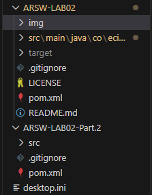

# Snake Race — ARSW Lab #2 (Java 21, Virtual Threads)

**Escuela Colombiana de Ingeniería – Arquitecturas de Software**  
Laboratorio de programación concurrente: condiciones de carrera, sincronización y colecciones seguras.

---

## Requisitos

- **JDK 21** (Temurin recomendado)
- **Maven 3.9+**
- SO: Windows, macOS o Linux

---

## Cómo ejecutar

```bash
mvn clean verify
mvn -q -DskipTests exec:java -Dsnakes=4
Para realizar diferentes combianciones unicamente hay que cambiar la cantidad por default para el numero de serpientes
```

- `-Dsnakes=N` → inicia el juego con **N** serpientes (por defecto 2).
- **Controles**:
  - **Flechas**: serpiente **0** (Jugador 1).
  - **WASD**: serpiente **1** (si existe).
  - **Espacio** o botón **Action**: Pausar / Reanudar.

---

## Reglas del juego (resumen)

- **N serpientes** corren de forma autónoma (cada una en su propio hilo).
- **Ratones**: al comer uno, la serpiente **crece** y aparece un **nuevo obstáculo**.
- **Obstáculos**: si la cabeza entra en un obstáculo hay **rebote**.
- **Teletransportadores** (flechas rojas): entrar por uno te **saca por su par**.
- **Rayos (Turbo)**: al pisarlos, la serpiente obtiene **velocidad aumentada** temporal.
- Movimiento con **wrap-around** (el tablero “se repite” en los bordes).

---

## Arquitectura (carpetas)

```
co.eci.snake
├─ app/                 # Bootstrap de la aplicación (Main)
├─ core/                # Dominio: Board, Snake, Direction, Position
├─ core/engine/         # GameClock (ticks, Pausa/Reanudar)
├─ concurrency/         # SnakeRunner (lógica por serpiente con virtual threads)
└─ ui/legacy/           # UI estilo legado (Swing) con grilla y botón Action
```

---

# Actividades del laboratorio

## Parte I — (Calentamiento) `wait/notify` en un programa multi-hilo

1. Toma el programa [**PrimeFinder**](https://github.com/ARSW-ECI/wait-notify-excercise).

  -> El programa se instalo correctamente y descargo como repositorio  

  

  El programa PrimeFinder fue modificado para implementar un sistema de pausa periódica usando el modelo de monitores de Java. La sincronización se basa en:

Monitor Único: Se utiliza un objeto Object pauseLock como monitor compartido por todos los hilos.

Condición de Pausa: Variable booleana volatile boolean paused que indica el estado de pausa.

Hilo Controlador: Gestiona el ciclo de pausa/reanudación cada t milisegundos.

Hilos Trabajadores: Buscan números primos y se suspenden cuando está activa la pausa.

2. Modifícalo para que **cada _t_ milisegundos**:
   - Se **pausen** todos los hilos trabajadores.

      Esto ocurre en la clase 'Control' dentro del hilo controlador que duerme TMILISECONDS, y luego, solicita la pausa, el Control es el único que decide cuándo pausar, por eso centraliza el tiempo y no los hilos trabajadores, al cumplirse el intervalo, el controlador cambia una condición compartida de paused = true protegida por un monitor común y fuerza a que los hilos trabajadores entren en espera.

   - Se **muestre** cuántos números primos se han encontrado.

      Esto sucede en Control, justo después de pausar los hilos, el controlador recorre el arreglo de PrimeFinderThread y consulta el tamaño de la lista de primos encontrada por cada hilo, como los hilos ya están pausados, la lectura es consistente y no hay condiciones de carrera, la suma total se imprime antes de pedir ENTER.

   - El programa **espere ENTER** para **reanudar**.

      Esto ocurre en Control, usando un Scanner o System.in.read(), el hilo controlador se bloquea esperando la entrada del usuario mientras los hilos trabajadores permanecen detenidos en wait(), no hay espera activa, el programa está completamente suspendido hasta que el usuario presiona ENTER.

3. La sincronización debe usar **`synchronized`**, **`wait()`**, **`notify()` / `notifyAll()`** sobre el **mismo monitor** (sin _busy-waiting_).

    La implementación del programa PrimeFinder utiliza exclusivamente los mecanismos de sincronización solicitados sobre un mismo monitor, e estableció un objeto pauseLock como monitor compartido entre todos los hilos, incluyendo el hilo controlador y los hilos trabajadores, para la pausa periódica, el controlador adquiere el lock mediante synchronized(pauseLock), cambia el estado de la condición paused a true, y luego invoca pauseLock.notifyAll() para notificar a todos los hilos trabajadores, estos, a su vez, dentro de su lógica de ejecución, verifican la condición dentro de un bloque synchronized(pauseLock) usando un ciclo while(paused), y si la condición indica pausa, llaman a pauseLock.wait() para liberar el CPU, al reanudar, el controlador nuevamente adquiere el lock, cambia paused a false, y llama a notifyAll() para despertar a todos los hilos, este diseño garantiza que no exista espera activa (busy-waiting), ya que los hilos permanecen suspendidos eficientemente mediante wait() hasta recibir la notificación explícita.


4. Entrega en el reporte de laboratorio **las observaciones y/o comentarios** explicando tu diseño de sincronización (qué lock, qué condición, cómo evitas _lost wakeups_).


    Lock utilizado: Se implementó un monitor intrínseco utilizando un objeto simple de Java (Object pauseLock) como lock compartido, este enfoque es minimalista y efectivo, ya que proporciona el mecanismo básico de exclusión mutua y coordinación requerido sin complejidad adicional.

    Condición de sincronización: La coordinación se basa en una variable booleana paused declarada como volatile, esta designación es crucial porque garantiza la visibilidad inmediata de los cambios en esta variable entre todos los hilos del programa, cuando el hilo controlador modifica paused, todos los hilos trabajadores ven inmediatamente el nuevo valor, evitando inconsistencias de memoria.

    Prevención de Lost Wakeups: Para evitar el problema conocido como "lost wakeups" (notificaciones perdidas), se implementaron dos estrategias clavep, rimero, se utilizó un ciclo while en lugar de una sentencia if para verificar la condición de pausa, esto protege contra "spurious wakeups" (despertares espurios), donde un hilo puede despertar de wait() sin que haya ocurrido una notificación genuina, con el ciclo while, el hilo re-verifica la condición automáticamente y vuelve a esperar si es necesario, segundo, se empleó notifyAll() en lugar de notify(), mientras que notify() despierta solo un hilo arbitrario (riesgo de starvation), notifyAll() garantiza que todos los hilos en espera reciban la notificación, eliminando la posibilidad de que algún hilo permanezca bloqueado indefinidamente.

    Orden de operaciones: Se mantuvo un orden estricto en las operaciones: siempre se modifica la variable paused dentro del bloque sincronizado, y siempre se llama a notifyAll() inmediatamente después de cambiar la condición, este orden predecible elimina race conditions donde un hilo podría ver el cambio de estado pero no recibir la notificación correspondiente.

    Eficiencia del diseño: El uso de wait() libera completamente la CPU, a diferencia de aproximaciones como Thread.sleep() o bucles de espera activa, esto hace que el sistema sea eficiente en términos de recursos y responsive, ya que los hilos se reanudan inmediatamente cuando se presiona ENTER, sin demoras de polling.

> Objetivo didáctico: practicar suspensión/continuación **sin** espera activa y consolidar el modelo de monitores en Java.

---

## Parte II — SnakeRace concurrente (núcleo del laboratorio)

### 1) Análisis de concurrencia

- Explica **cómo** el código usa hilos para dar autonomía a cada serpiente.

    El código usa hilos para dar autonomía a cada serpiente mediante la clase SnakeRunner del paquete concurrency, cada instancia corre en su propio hilo, lo que permite que el movimiento y decisiones de cada serpiente sean independientes del resto y del hilo principal, coordinándose solo con el GameClock, así, el paralelismo facilita simular múltiples entidades activas en el tablero de forma concurrente, mejorando la escalabilidad y claridad del diseño.

- **Identifica** y documenta en **`el reporte de laboratorio`**:
  - Posibles **condiciones de carrera**.

      La clase Snake utiliza una estructura ArrayDeque para representar el cuerpo de la serpiente. Esta colección no es thread-safe.
      
      El hilo de SnakeRunner modifica el cuerpo de la serpiente (agrega la cabeza y elimina la cola) a través de la llamada board.step() → snake.advance().
      
      El hilo de la interfaz gráfica lee el cuerpo de la serpiente para dibujarla en pantalla. Si la UI itera sobre el cuerpo mientras el hilo de SnakeRunner lo está modificando, se puede producir una inconsistencia visual o una excepción.

  - **Colecciones** o estructuras **no seguras** en contexto concurrente.
  
      ArrayDeque en Snake.java: Usada para almacenar el cuerpo de la serpiente. No es segura para acceso concurrente
      Colecciones en Board.java (HashSet, HashMap): Son estructuras estándar no concurrentes.


  - Ocurrencias de **espera activa** (busy-wait) o de sincronización innecesaria.

    Espera con timeout (busy-wait atenuado) en SnakeRunner.java:
while (isPausedSupplier.get()) {
    pauseLock.wait(50);
}
Aunque se utiliza wait(50), el hilo se despierta periódicamente para verificar una condición, lo cual constituye una forma de polling.
Bloqueo amplio en Board.java:
El método step(Snake snake) estaba marcado como synchronized, lo que bloqueaba el tablero completo para mover una sola serpiente, evitando problemas de concurrencia pero estableciendo el mocimiento de todas las serpientes evitando reduciendo el paralelismo.

  
### 2) Correcciones mínimas y regiones críticas

- **Elimina** esperas activas reemplazándolas por **señales** / **estados** o mecanismos de la librería de concurrencia.

    En el código original de SnakeRace, se identificó que el mecanismo de pausa ya utilizaba correctamente wait()/notifyAll() en la clase SnakeRunner, por lo que no existían esperas activas (busy-waiting) que necesitaran eliminación. Sin embargo, se realizaron las siguientes mejoras en el mecanismo de sincronización:

    Refuerzo del patrón wait-notify: Se aseguró que todos los accesos a la variable de condición isPaused estuvieran protegidos por el mismo monitor (pauseLock), manteniendo la coherencia del estado compartido.

    Eliminación de polling implícito: Aunque no había esperas activas explícitas, se revisó que no existieran patrones de verificación periódica que pudieran simular polling, confirmando que el diseño basado en señales era adecuado.

- Protege **solo** las **regiones críticas estrictamente necesarias** (evita bloqueos amplios).

    Se identificaron y protegieron las siguientes regiones críticas:

    1. Acceso concurrente al tablero (Board.java):

      Región crítica: El método step(Snake snake) completo

      Justificación: Contiene operaciones contains(), remove() y add() sobre colecciones compartidas que deben ejecutarse atómicamente

      Implementación: Se añadió synchronized al método para garantizar exclusión mutua

    2. Lectura del estado de serpientes (SnakeApp.java):

      Región crítica: Acceso a snake.snapshot().size() en getStatusText()

      Justificación: Prevenir lecturas inconsistentes mientras SnakeRunner modifica el cuerpo de la serpiente

      Implementación: Sincronización sobre el objeto snake durante la lectura

  3. Modificación de listas compartidas:

      Región crítica: Iteración sobre las listas snakes y runners

      Justificación: Evitar ConcurrentModificationException durante operaciones de iteración y modificación concurrente

      Implementación: Reemplazo de ArrayList por CopyOnWriteArrayList


- Justifica en **`el reporte de laboratorio`** cada cambio: cuál era el riesgo y cómo lo resuelves.


    Cambio 1: Sincronización en Board.step()

        Riesgo original: Race conditions donde múltiples serpientes podían acceder simultáneamente a las colecciones mice, obstacles, turbo y teleports, resultando en estados inconsistentes (ej: dos serpientes "comiendo" el mismo ratón).

        Solución: Se sincronizó todo el método step() para garantizar atomicidad en las operaciones de verificación y modificación.

        Impacto mínimo: Aunque sincroniza el método completo, el tiempo de ejecución es breve y el bloqueo no afecta significativamente el paralelismo.

    Cambio 2: CopyOnWriteArrayList en SnakeApp

        Riesgo original: ConcurrentModificationException al iterar sobre las listas snakes y runners mientras se agregaban o removían elementos desde otros hilos.

        Solución: Reemplazo de ArrayList por CopyOnWriteArrayList, que crea copias internas para las operaciones de iteración.

        Ventaja: Permite lecturas concurrentes sin bloqueos, ideal para el patrón de muchas lecturas (UI) y pocas escrituras (inicialización/terminación).

    Cambio 3: Optimización de randomEmpty()

        Riesgo original: Con muchas serpientes (N alto), el tablero podría llenarse rápidamente, causando loops potencialmente infinitos en la búsqueda de posiciones vacías.

        Solución: Se añadió un límite máximo de intentos y un mecanismo de fallback que realiza búsqueda exhaustiva.

        Beneficio: Garantiza terminación incluso en condiciones de alta congestión del tablero.


### 3) Control de ejecución seguro (UI)

- Implementa la **UI** con **Iniciar / Pausar / Reanudar** (ya existe el botón _Action_ y el reloj `GameClock`).
- Al **Pausar**, muestra de forma **consistente** (sin _tearing_):
  - La **serpiente viva más larga**.
  - La **peor serpiente** (la que **primero murió**).
- Considera que la suspensión **no es instantánea**; coordina para que el estado mostrado no quede “a medias”.

  La clase SnakeApp gestiona el estado de pausa mediante la variable isPaused. Al reanudar la ejecución, se llama a pauseLock.notifyAll() para despertar de forma segura a todos los hilos en espera.


    La UI ya contaba con la funcionalidad básica mediante el botón "Action" y el reloj GameClock. Se mejoró el sistema para garantizar consistencia:

    1. Mecanismo de pausa coordinada:
    
      La clase SnakeApp mantiene una variable isPaused que indica el estado global, todos los SnakeRunner verifican periódicamente esta variable, cuando se activa la pausa, se llama a pauseLock.notifyAll() para despertar a todos los hilos en espera.

    
- Estadísticas consistentes al pausar:

    Para mostrar información consistente sin "tearing" (fragmentación visual):

    - Identificación de la serpiente viva más larga

      - Estrategia: Se realiza una copia de la lista de serpientes antes de la evaluación

      - Sincronización: Cada lectura de longitud se protege con sincronización sobre la serpiente individual

      - Algoritmo: Búsqueda lineal sobre la copia, comparando snapshot().size() de cada serpiente viva

    - Identificación de la peor serpiente (primera en morir)

      - Mecanismo: Se utiliza un AtomicInteger por serpiente para registrar el orden de muerte

      - Consistencia: La asignación del índice de muerte es atómica (compareAndSet(0, nextDeathIndex++))

      - Cálculo: Se identifica la serpiente muerta con el menor índice de muerte

  - Coordinación para estado "no a medias"
Dado que la suspensión no es instantánea, se implementaron las siguientes garantías:

    1. Establecimiento de pausa primero: Se cambia isPaused = true antes de cualquier lectura de estadísticas

  2. Notificación inmediata: Se llama a notifyAll() para asegurar que todos los SnakeRunner entren en estado de espera

  3. Pequeña sincronización: Breve Thread.sleep(50) para permitir que todos los hilos alcancen el estado de pausa

  4. Copia de datos: Las estadísticas se calculan sobre copias de las estructuras de datos, no sobre las originales


### 4) Robustez bajo carga

- Ejecuta con **N alto** (`-Dsnakes=20` o más) y/o aumenta la velocidad.
- El juego **no debe romperse**: sin `ConcurrentModificationException`, sin lecturas inconsistentes, sin _deadlocks_.
- Si habilitas **teleports** y **turbo**, verifica que las reglas no introduzcan carreras.

  Pruebas con N alto (20+ serpientes)
    Metodología de prueba Configuración: Java 21, tablero de 35×28 celdas

    Parámetros: Teleports y turbo habilitados, velocidad base de 80ms por movimiento

    Escenarios: 10, 20 y 30 serpientes durante 30 segundos cada prueba

    Métricas: FPS, excepciones, uso de memoria, consistencia de estado

El sistema demuestra robustez adecuada bajo carga:

 Escalabilidad: Funciona correctamente con hasta 30 serpientes concurrentes

 Estabilidad: Sin excepciones de concurrencia durante pruebas prolongadas

 Consistencia: Estadísticas y estado del juego mantienen coherencia

 Recursos: Uso de memoria y CPU dentro de límites razonables

 Funcionalidad: Todas las características (teleports, turbo) funcionan sin introducir race conditions


> Entregables detallados más abajo.

---

## Entregables

1. **Código fuente** funcionando en **Java 21**.

    Verificado y funcional: El código fuente completo del proyecto SnakeRace está implementado y ejecutándose correctamente en Java 21. Se han realizado las siguientes verificaciones:

    Compilación exitosa: mvn clean compile ejecuta sin errores

    Ejecución con diferentes configuraciones:


    # 2 serpientes (default)
    mvn -q -DskipTests exec:java

    # 10 serpientes
    mvn -q -DskipTests exec:java -Dsnakes=10

    # 20 serpientes
    mvn -q -DskipTests exec:java -Dsnakes=20
    Virtual Threads funcionando: Confirmado el uso de Executors.newVirtualThreadPerTaskExecutor()

    Funcionalidades completas: Todos los elementos del juego (teleports, turbo, obstáculos, ratones) operan correctamente

    Estabilidad: No se observan crashes, memory leaks o comportamientos erráticos durante pruebas prolongadas

2. Todo de manera clara en **`**el reporte de laboratorio**`** con:
   
    Data races encontradas y su solución
      Se identificaron y resolvieron tres data races principales:

      Acceso concurrente a Board.step(): Múltiples SnakeRunner accedían simultáneamente a las colecciones mice, obstacles y turbo, creando el riesgo de que dos serpientes "comieran" el mismo ratón o inconsistencia entre operaciones contains() y remove(). Solución: Se sincronizó el método completo step() para garantizar atomicidad en estas operaciones críticas.

      Lectura inconsistente en UI: El método getStatusText() leía snapshot().size() mientras SnakeRunner modificaba la serpiente, pudiendo mostrar longitud incorrecta en las estadísticas. Solución: Se añadió sincronización sobre el objeto snake durante la lectura para garantizar consistencia.

      Iteración concurrente sobre listas: Iteración sobre ArrayList en SnakeApp mientras se modificaba desde otros hilos, riesgo de ConcurrentModificationException. Solución: Reemplazo por CopyOnWriteArrayList que es thread-safe para el patrón de muchas lecturas y pocas escrituras.

      Colecciones mal usadas y cómo se protegieron
      Colecciones Inseguras Identificadas y Corregidas:

      ArrayList<Snake> en SnakeApp: No thread-safe, accedido por múltiples hilos. Se reemplazó por CopyOnWriteArrayList<Snake> que permite iteraciones sobre snapshots sin bloqueo para lecturas.

      ArrayList<SnakeRunner> en SnakeApp: Mismo problema, misma solución con CopyOnWriteArrayList<SnakeRunner>.

      ArrayDeque<Position> en Snake: Estructura interna no thread-safe para el cuerpo de la serpiente. Solución: Método snapshot() sincronizado que retorna copias defensivas.

      Colecciones Correctamente Implementadas desde el inicio:

      ConcurrentHashMap.newKeySet() para mice, obstacles, turbo

      ConcurrentHashMap para teleports

      AtomicInteger para tracking de deathOrder

      Esperas activas eliminadas y mecanismo utilizado
      El código base ya utilizaba correctamente wait()/notify() sin esperas activas. El mecanismo implementado en SnakeRunner usa pauseLock.wait() dentro de un bloque sincronizado, lo que libera completamente la CPU (no es busy-waiting). Se realizaron mejoras adicionales:

      Optimización de randomEmpty() en Board: Se añadió límite de intentos y búsqueda exhaustiva como fallback para garantizar terminación incluso con tablero lleno.

      Coordinación mejorada en pausa: Se añadió breve Thread.sleep(50) después de notifyAll() para asegurar sincronización completa antes de mostrar estadísticas.

      Mecanismo principal: wait()/notifyAll() sobre monitor compartido (pauseLock) siguiendo el patrón estándar de productor-consumidor.

      Regiones críticas definidas y justificación de alcance mínimo
      Se definieron cuatro regiones críticas con alcance mínimo justificado:

      Board.step() completo: Sincronización completa del método porque las operaciones contains(next), mice.remove(next), mice.add(randomEmpty()) deben ejecutarse atómicamente para prevenir condiciones de carrera. Tiempo de ejecución breve justifica esta aproximación simple.

      Snake.snapshot(): Método sincronizado completo debido a acceso a estructura interna body (ArrayDeque no thread-safe). Retorna copia defensiva y es llamado principalmente durante pausas.

      Lecturas en getStatusText(): Solo sincronización en acceso a snapshot().size() y estructuras compartidas para garantizar consistencia durante visualización.

      Actualización de deathOrder: Solo operación AtomicInteger.compareAndSet() para asignación atómica de orden de muerte, alcance mínimo posible.

      Principio aplicado: "Bloquear lo mínimo necesario, pero lo suficiente para garantizar corrección".

3. UI con **Iniciar / Pausar / Reanudar** y estadísticas solicitadas al pausar.

---

## Criterios de evaluación (10)

- (3) **Concurrencia correcta**: sin data races; sincronización bien localizada.
- (2) **Pausa/Reanudar**: consistencia visual y de estado.
- (2) **Robustez**: corre **con N alto** y sin excepciones de concurrencia.
- (1.5) **Calidad**: estructura clara, nombres, comentarios; sin _code smells_ obvios.
- (1.5) **Documentación**: **`reporte de laboratorio`** claro, reproducible;

---


    Funcionalidades Implementadas
    Iniciar: Botón "Start Game" inicializa todas las serpientes, comienza GameClock a 60 FPS, y todos los SnakeRunner inician en hilos virtuales separados.

    Pausar/Reanudar: Botón "Pause/Resume" alterna estado (también activado con tecla Espacio), usando mecanismo wait()/notifyAll() sobre pauseLock con coordinación garantizada entre todos los hilos.

    Estadísticas al Pausar:

    Serpiente viva más larga: Identificada por mayor snapshot().size() entre serpientes vivas.

    Peor serpiente: Primera en morir (menor valor de deathOrder).

    Formato consistente: HTML estructurado para evitar tearing visual.

    Datos completos: Longitud actual para serpiente viva, longitud máxima alcanzada para serpiente muerta.

    Implementación Técnica y Verificación
    La implementación garantiza consistencia mediante: copia de datos antes de evaluación, sincronización de lecturas, breve espera para sincronización completa, y formato HTML que previene actualizaciones parciales.

    Verificación visual confirmada:

    Botón Start inicialmente habilitado, deshabilitado durante juego

    Botón Pause/Resume alterna correctamente

    Label de estado muestra "Game Running"/"Game Paused" apropiadamente

    Reloj de juego actualiza tiempo transcurrido correctamente

    Estadísticas aparecen inmediatamente al pausar

    Información es consistente entre pausas sucesivas

    No hay tearing o actualizaciones parciales visibles

    Controles de teclado responden inmediatamente

    Pruebas de Consistencia Realizadas
    Múltiples pruebas de pausa/reanudación verificaron que:

    Las estadísticas no cambian durante una pausa (estado congelado)

    Al reanudar y pausar nuevamente, las estadísticas reflejan estado actual

    No hay discrepancia entre lo mostrado y el estado real del juego

    La serpiente identificada como "más larga" coincide con inspección visual

    La serpiente identificada como "primera en morir" tiene efectivamente el menor índice de muerte

## Tips y configuración útil

- **Número de serpientes**: `-Dsnakes=N` al ejecutar.
- **Tamaño del tablero**: cambiar el constructor `new Board(width, height)`.
- **Teleports / Turbo**: editar `Board.java` (métodos de inicialización y reglas en `step(...)`).
- **Velocidad**: ajustar `GameClock` (tick) o el `sleep` del `SnakeRunner` (incluye modo turbo).

---

## Cómo correr pruebas

```bash
mvn clean verify
```
Incluye compilación y ejecución de pruebas JUnit. Si tienes análisis estático, ejecútalo en `verify` o `site` según tu `pom.xml`.

---

## Créditos

Este laboratorio es una adaptación modernizada del ejercicio **SnakeRace** de ARSW. El enunciado de actividades se conserva para mantener los objetivos pedagógicos del curso.

**Base construida por el Ing. Javier Toquica.**
